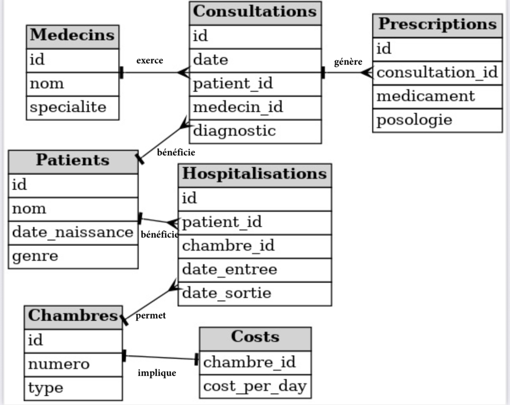

# Utilisation de base de données au sein d'un hôpital

## Objectif
Ce projet a pour but de mettre en évidence l'importance de l'utilisation d'une base de données dans le milieu de la santé. Mon intérêt sera davantage porté sur les requêtes que l'on peut formuler que sur les données qui sont très simples et synthétiques. Ces requêtes permettront de montrer comment une base de données permet de faciliter le suivi des patients, gérer l'organisation des chambres d'hospitalisations ainsi que celle des médecins. L'objectif est de montrer que si parfois le progrès technique peut effrayer ou même nous échapper, il peut être utilisé de façon à améliorer notre système de santé et à veiller au bon fonctionnement d'un établissement si important.

## Les données
Les données utilisées sont générées aléatoirement par OpenAI, elles sont donc très simplifiées et ne sont pas nombreuses. Dans certains cas, cela pourra affecter lourdement le résultat lié à nos requêtes, soit il s'affiche mais n'est pas très pertinent soit aucune donnée ne correspond aux conditions de la requête. Pour pallier cela, j'ai parfois ajouté l'apparition d'un message d'erreur qui nous explique que nous n'avons pas les données nécessaires, afin que l'on puisse tout de même obtenir un résultat. Dans le cas où le résultat s'affiche mais n'est pas pertinent, je n'ai pas adapté la requête car elle fonctionnera parfaitement avec un plus large panel.

Vous trouverez les structures des tables ainsi que leur contenu [Voir le fichier database.sql](https://github.com/luciematt/SQL1/blob/main/database.sql)

La base de données utilisée comporte alors de nombreuses limites mais sert avant tout de structure pour formuler les requêtes qui sont, elles, plus abouties et performantes. Vous trouverez un titre associé à chacune d'entre-elles afin de comprendre son but et de comprendre le rôle qu'elle peut jouer dans l'organisation d'un établissement aussi important qu'un hôpital. 

